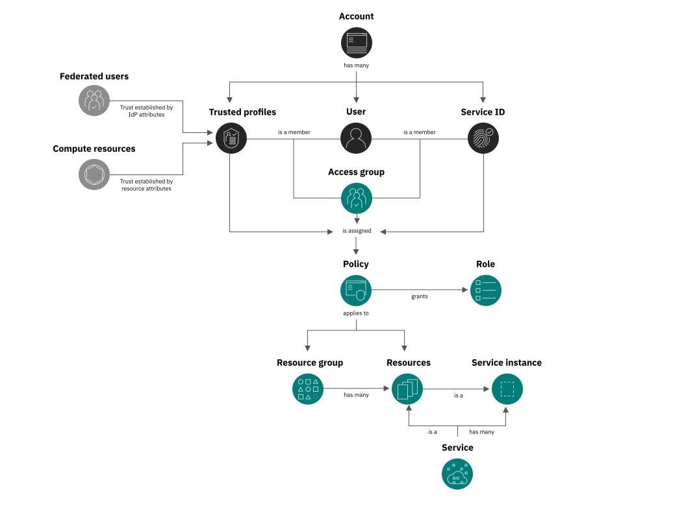

---

copyright:

  years: 2017, 2026
lastupdated: "2026-04-06"

keywords: what is IAM, IAM features, IAM API, how IAM works, centralized access management, standards-based, enterprise access control, workload, identity provider, centralized management, fine-grained access, enterprise, layered security architectures, attack surface, SSO, least-privilege access, defense in depth, standards-based identity and access management

subcollection: iam

---

{{site.data.keyword.attribute-definition-list}}

# Getting started with {{site.data.keyword.cloud_notm}} IAM
{: #iamoverview}

{{site.data.keyword.cloud}} Identity and Access Management (IAM) provides centralized, standards-based identity and access management with fine-grained access control to implement least-privilege access across your enterprise workloads and reduce your attack surface.
{: shortdesc}

Securely authenticate users for platform services and control access to resources consistently across {{site.data.keyword.cloud_notm}}. A set of services is enabled to use IAM for access control, and are organized into [resource groups](/docs/account?topic=account-rgs) within your account so you can give users access quickly to more than one resource at a time. Each of these services is labeled as "IAM-enabled" in the catalog. You can use IAM access policies to assign users, service IDs, and trusted profiles access to resources within your account. And, you can group users, service IDs, and trusted profiles into an access group to easily give all members of the group the same level of access.

You can use trusted profiles to automate the grouping and granting of access to users, services, and app identities. By specifying conditions based on SAML attributes for users whose identity is federated from your external identity provider (IdP), users can be granted access to resources without having to be invited to the account if they meet those conditions. For service and app identities, you can define fine-grained authorization for all applications that are running in a compute resource without creating service IDs or managing the API key lifecycle for applications.

{: caption="How IAM access works in an account by using access groups. Service IDs and select {{site.data.keyword.cloud_notm}} can also asssume trusted profiles." caption-side="bottom"}

For classic infrastructure that doesn't support the use of IAM policies for managing access, see [Managing classic infrastructure access](/docs/iam?topic=iam-mngclassicinfra).
{: note}

Complete the following steps to get started with the comprehensive set of IAM features that are available for managing access to your {{site.data.keyword.cloud_notm}} resources:

1. Control who can access your resources with fine-grained policies, access groups, and time-based conditions. See [IAM access concepts](/docs/iam?topic=iam-access-management-overview) and [IAM identities](/docs/iam?topic=iam-identity-overview).
1. Plan your access strategy by learning about [least privilege access](/docs/iam?topic=iam-least-privilege) and reviewing [IAM policies overview](/docs/iam?topic=iam-iamusermanpol).
1. Invite users and assign access to your account by following the [Assigning access quickstart tutorial](/docs/iam?topic=iam-access-getstarted).
1. Automate access for federated users and compute resources without managing credentials. See [Managing access for federated users](/docs/iam?topic=iam-trustedprofile-fedusers-tutorial) and [Managing access for compute resources](/docs/iam?topic=iam-trustedprofile-compute-tutorial).
1. Implement defense in depth with service authorizations and context-based restrictions. See [Granting access between services](/docs/iam?topic=iam-serviceauth) and [Leveraging context-based restrictions to secure your resources](/docs/iam?topic=iam-context-restrictions-tutorial).
