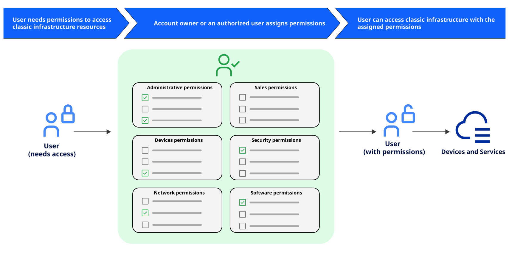

---

copyright:

  years: 2017, 2026
lastupdated: "2026-06-04"

keywords: classic infrastructure access, VPN subnet access, classic infrastructure permissions, device access

subcollection: iam

---

{{site.data.keyword.attribute-definition-list}}

# Managing classic infrastructure access
{: #mngclassicinfra}

When you invite a user to your account, you can select from three classic infrastructure permission sets that assign bulk access: View only, Basic user, Super user. You can update permissions for classic infrastructure services or add device and VPN subnet access for a user at any time. To access the classic infrastructure permissions, go to **Manage** > **Access (IAM)** in the {{site.data.keyword.cloud}} console, select **Users**. Then, select the user's name that you want to update access for, and click **Classic infrastructure**.
{: shortdesc}

## Classic infrastructure permissions
{: #how-classic-infra-permissions-work}

When you invite someone to the account, only you, the account owner, or a user with the Manage user classic infrastructure permission, can adjust the permissions for the user. You can assign only the level of permissions or a subset of the permission that you're already assigned, if you're not the account owner. An account owner can update anyone's permissions in the account to have any level of access.

Additional permissions can be set after the user accepts the invitation. For example, the initial permission set assigned on the invitation doesn't grant access to devices. So, you must grant device access after the user accepts the invitation.

Support center account management access is recommended for users that work with classic infrastructure resources. To complete many tasks on classic infrastructure resources, such as creating or deleting a virtual server instance, users must have access to work with support cases. For more information about assigning this type of access, see [Assigning access to account management services](/docs/iam?topic=iam-account-services).
{: tip}

The following graphic shows how classic infrastructure permissions are assigned per user. You can grant each user access to a classic infrastructure service or device by selecting from the granular permission options to customize each user's access.

{: caption="Assigning classic infrastructure access by selecting a user, device, or service, then any combination of granular permissions" caption-side="bottom"}

Classic infrastructure has six main categories of permissions to choose from: Administrative, Devices, Network, Sales, Security, and Software. The following sections provide a complete list of all available permissions in each category.

| Permission          | Description                                        |
|---------------------|----------------------------------------------------|
| Activate Partner Customer Account | Enable partner accounts to begin managing customer resources and billing |
| Add Brand Account | Create sub-brand accounts for reseller or partner organizational hierarchies |
| Add Customer Account | Create new customer accounts within the account structure |
| Manage Account Notes | Add, edit, and delete internal notes for account documentation and tracking |
| Manage E-mail Delivery Service | Configure e-mail delivery service accounts for system notifications |
| Manage Notification Subscribers | Create and manage notification subscribers for usage warnings and overages |
| Manage Users | Add, remove, and modify user access and classic infrastructure permissions |
| Physically Access a Customer's Colo Cage | Authorize physical entry to customer colocation cages in data centers |
| Physically Access a Datacenter | Authorize physical entry to IBM Cloud data center facilities |
| View Event Log | Access the account-wide event log history for audit and troubleshooting purposes |
{: class="simple-tab-table"}
{: caption="Administrative permissions for classic infrastructure" caption-side="bottom"}
{: tab-group="classic-infra-permissions"}
{: #permissions-tab1}
{: tab-title="Administrative"}
{: summary="Use the tab buttons to change the context of the table. This table provides the description for classic infrastructure administrative permissions."}

| Permission          | Description                                        |
|---------------------|----------------------------------------------------|
| Add IP Addresses | Assign additional IP addresses to servers for network configuration |
| Edit Hostname/Domain | Modify hostname and domain name settings for devices |
| Host IDS | Access Host Intrusion Detection System logs for security monitoring |
| IPMI Remote Management | Access IPMI interface to view hardware details and issue remote reboot commands through the portal |
| Manage Configuration Template | Create, edit, and delete configuration templates for automated device setup |
| Manage Customer Hardware | Perform administrative actions on bare metal servers and hardware devices |
| Manage Device Monitoring | Configure monitoring settings and view performance metrics for devices |
| Manage Provisioning Scripts | Create and modify post-provisioning scripts that run after device deployment |
| Manage Public Images | Create, edit, and delete public image templates available across the account |
| OS Reloads and Rescue Kernel | Initiate operating system reloads and boot devices into rescue mode for recovery |
| Storage Manage | Access storage volume details and modify storage access credentials |
| View Hardware Details | Access hardware specifications, IP addresses, OS type, and passwords; includes ability to update hardware passwords in the portal |
| View Location Reservation | Access information about reserved data center locations and capacity |
| View Virtual Dedicated Host Details | Access virtual dedicated host specifications and migrate instances between hosts |
| View Virtual Server Details | Access virtual server specifications, IP addresses, OS type, and passwords; includes ability to update virtual server passwords in the portal |
| View and edit dedicated host | Access and modify dedicated host configurations and settings |
| View and edit virtual guest | Access and modify virtual guest properties and configurations |
{: class="simple-tab-table"}
{: caption="Device permissions for classic infrastructure" caption-side="bottom"}
{: tab-group="classic-infra-permissions"}
{: #permissions-tab2}
{: tab-title="Devices"}
{: summary="Use the tab buttons to change the context of the table. This table provides the description for classic infrastructure device permissions."}

| Permission          | Description                                        |
|---------------------|----------------------------------------------------|
| Add Compute with Public Network Port | Provision servers or cloud instances with public network connectivity and port speeds |
| Manage CDN Account | Configure and maintain content delivery network account settings |
| Manage CDN File Transfers | Upload, download, and manage files distributed through the content delivery network |
| Manage DNS | Create, modify, and delete DNS records for domains managed by SoftLayer |
| Manage Firewall Rules | Create, modify, and delete firewall rules across all network devices |
| Manage Firewalls | Configure firewall settings and review firewall logs for security analysis |
| Manage Load Balancers | Configure, monitor, and maintain load balancer services |
| Manage Network Gateways | Configure and maintain network gateway appliances for routing and security |
| Manage Network Subnet Routes | Define and modify routing rules for network subnets |
| Manage Network VLAN Spanning | Control whether private network VLANs can communicate across the account |
| Manage Port Control | Configure network port status and connection speeds for devices |
| Manage Private Endpoint Service | Enable or disable private endpoint connectivity for secure service access |
| Manage Security Groups | Create, modify, and delete security groups and their associated rules |
| VPN Administration | Configure VPN access settings and manage VPN permissions for all account users |
| View Bandwidth Statistics | Access bandwidth usage data and graphs for hardware devices |
| View CDN Bandwidth Statistics | Access bandwidth usage data for content delivery network services |
{: class="simple-tab-table"}
{: caption="Network permissions for classic infrastructure" caption-side="bottom"}
{: tab-group="classic-infra-permissions"}
{: #permissions-tab3}
{: tab-title="Network"}
{: summary="Use the tab buttons to change the context of the table. This table provides the description for classic infrastructure network permissions."}

| Permission          | Description                                        |
|---------------------|----------------------------------------------------|
| Add Server | Order and provision new bare metal or virtual servers |
| Add/Upgrade Cloud Instances | Order new cloud instances and upgrade existing instance configurations |
| Add/Upgrade Services | Order new services and upgrade existing service plans |
| Add/Upgrade Storage (StorageLayer) | Order new storage volumes and upgrade existing storage capacity |
| Cancel Server | Terminate server instances and remove them from billing |
| Cancel Services | Terminate services and remove them from billing |
| Upgrade Server | Modify server specifications such as CPU, RAM, or disk capacity |
| Upgrade Services | Modify service plans and configurations for existing services |
| View Billing ACH Information | Access Automated Clearing House payment details for billing transactions |
| View reseller order pricing | Access special pricing information available to reseller accounts |
{: class="simple-tab-table"}
{: caption="Sales permissions for classic infrastructure" caption-side="bottom"}
{: tab-group="classic-infra-permissions"}
{: #permissions-tab4}
{: tab-title="Sales"}
{: summary="Use the tab buttons to change the context of the table. This table provides the description for classic infrastructure sales permissions."}

| Permission          | Description                                        |
|---------------------|----------------------------------------------------|
| Manage Certificates (SSL) | Upload, modify, and delete SSL/TLS certificates including private keys |
| Manage SAML Authentication | Configure SAML identity provider settings for federated authentication |
| Manage SSH Keys | Upload, modify, and delete SSH public keys for secure server access |
| View Certificates (SSL) | Access SSL/TLS certificate details including private keys |
{: class="simple-tab-table"}
{: caption="Security permissions for classic infrastructure" caption-side="bottom"}
{: tab-group="classic-infra-permissions"}
{: #permissions-tab5}
{: tab-title="Security"}
{: summary="Use the tab buttons to change the context of the table. This table provides the description for classic infrastructure security permissions."}

| Permission          | Description                                        |
|---------------------|----------------------------------------------------|
| Manage Antivirus/Spyware | Configure antivirus and spyware protection settings and review security logs |
| Manage Firewall Software | Configure and maintain software-based firewall applications |
| Openstack Link | Establish or remove OpenStack integration for hybrid cloud connectivity |
| View Customer Software Password | Access passwords for customer-installed software applications |
| View Helm | Access login credentials for Helm package manager |
| View Plesk | Access login credentials for Plesk control panel |
| View QuantaStor | Access login credentials for QuantaStor storage management system |
| View Urchin | Access login credentials for Urchin web analytics software |
| View and edit disk image | Access and modify disk image files and metadata |
| View and edit manage image template | Access and modify image templates used for device provisioning |
| View and edit software component | Access and modify software component configurations |
| View cPanel | Access login credentials for cPanel control panel |
| View licenses | Access software license information and keys |
| View software account license | Access account-level software licensing details and entitlements |
{: class="simple-tab-table"}
{: caption="Software permissions for classic infrastructure" caption-side="bottom"}
{: tab-group="classic-infra-permissions"}
{: #permissions-tab6}
{: tab-title="Software"}
{: summary="Use the tab buttons to change the context of the table. This table provides the description for classic infrastructure software permissions."}

To view and assign these permissions, go to **Manage** > **Access (IAM)** > **Users** in the {{site.data.keyword.cloud_notm}} console. Then, select a user's name from the list that you can manage access for, and click **Classic infrastructure**.

### Migrated classic infrastructure permissions
{: #predefined}

A set of classic infrastructure permissions for viewing and managing billing information and working with support cases are now migrated to access groups. The users in your account who were previously assigned these permissions are now assigned to the respective migrated permission access group. As a result, the classic infrastructure permissions can be directly managed by using IAM access policies. For more information about the migrated permissions and the access groups that are used for each, see [Managing migrated SoftLayer account permissions](/docs/iam?topic=iam-migrated_permissions).

## Assigning classic infrastructure permissions
{: #assign-classic-infra}

You must be assigned the Manage users classic infrastructure permission and be an ancestor of the user within the classic infrastructure user hierarchy. Account owners have full access to the account, so they do not see the permissions on the page. Individual users can't edit their own permissions, and they also don't see permissions on the page.

When a classic infrastructure user invites another user to the account, the classic infrastructure user becomes the parent user. When a child of a parent invites other users to the account, those users become descendants of the original parent, who is now considered their ancestor.
{: note}

1. In the {{site.data.keyword.cloud_notm}} console, go to **Manage** > **Access (IAM)**, select **Users**. Then, select the user's name that you want to update access for, and click **Classic infrastructure**.

1. Select **Permissions** to update the user's permissions. You can select from six types of permissions: Administrative, Devices, Network, Sales, Security, and Software. Individually select permissions from each category, or use a permission set option to assign permissions in bulk.

   The account management and support permissions that you previously assigned to users in your account are now migrated from classic infrastructure permissions to migrated IAM access groups. For more information, see [Managing migrated SoftLayer account permissions](/docs/iam?topic=iam-migrated_permissions).

1. To grant a user device access, select **Devices**, and assign the access to specific devices and device types as needed.

   Access to devices is assigned after the user is invited to the account. The device permissions apply to the specific devices that are assigned for the user. You can select specific devices from the list, or you can assign access by device type. If you assign access by device type, you might want to use the **Enable future access** options. This way, you ensure that each time new devices of a specific type are added, the user automatically gets assigned access to those devices.

1. To update a user's access to VPN subnets, select **VPN subnets**.

   You must have the following type of access to assign VPN access:

   * To update your own access, you must have the VPN Administration permission or be the master user.
   * To update a user to which you are a parent, you must have the VPN Administration permission.
   * To update any user's access, you must have the VPN Administration permission and an IAM policy on the User management service with Viewer role or higher assigned or be the master user.

   Use the **Auto-assign** option to set how the user gets access to VPN subnets based on their device access. If this option is set to on, the user is automatically assigned access to all subnets for the devices they already have access to. You can set this option to off to manually select subnets from the list.

   You can define the type of VPN subnets that the user has access to by using the **VPN type** option. If you select **None**, no VPN access can be assigned. If you have the correct access, you can define the type of VPN subnets that the user has access to by using the VPN type option. If you select None, no VPN access can be assigned.
